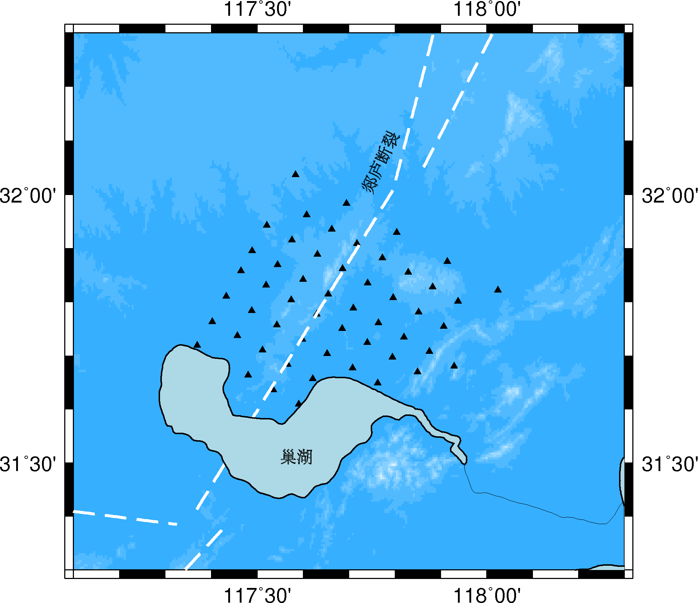
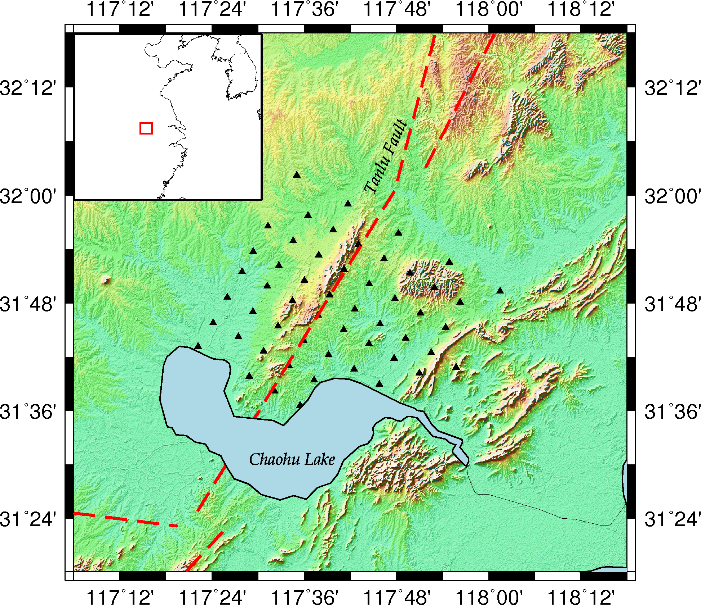
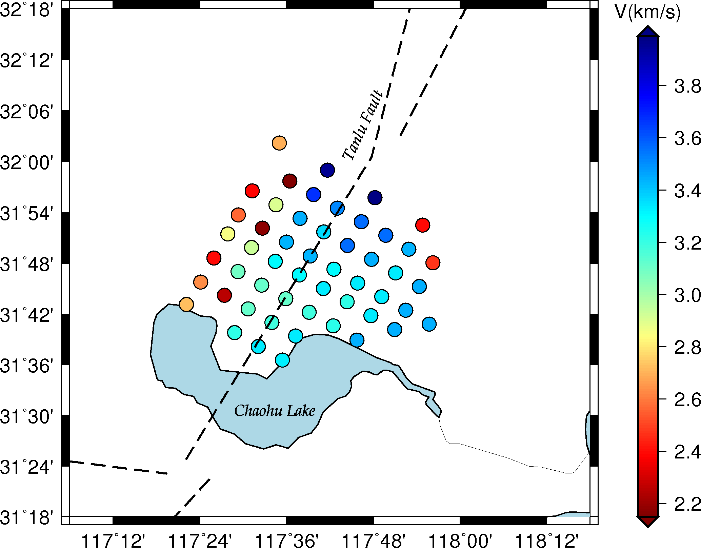

<!--more-->GMT是个强大的画图工具，想要画漂亮的地形图关键是地形数据要高精度。之前画的图一直不好看，后来发现是由于地形数据精度不够，细节显示不出来，而我画的区域很小，也就0.5x0.7度。后来用了精度为3弧秒的全球起伏地形数据，再加上光照，效果就好很多了。见下两幅图：

 

  
 代码如下：
 
	#!/bin/bash
	xmin=117.1
	xmax=118.3
	ymin=31.3
	ymax=32.3
	R=$xmin/$xmax/$ymin/$ymax
	B=a1
	Inc=0.5m
	J=M13c
	PS=p.ps
	station=station_fd.txt

	grdcut Feidong.grd -Gfd.grd -R$R
	makecpt -Ctopo -T-100/400/20  > colors.cpt

	 psxy  -J$J -R$R  -T  -K > $PS
	 grdgradient fd.grd -Gfd.int -A0/270 -Nt 
	 grdimage fd.grd -R$R -J$J -Ba0.2f0.1 -Ifd.int -Ccolors.cpt -O -K >> $PS

	 psxy $station -J$J -R$R -St0.2 -Gblack  -O -K >> $PS

	 psxy -J$J -R$R China_tectonic.dat -W1.8p,red,- -O -K >>$PS
	 pscoast -R$R -J$J  -Dh -W0.8p -Slightblue -I2p -N1/2p -A50 -O -K >> $PS

	 pstext -J$J -R$R -Gblack -S1 -O -K >> $PS << EOF
	117.75 32 11 65 30 BL Tanlu Fault
	117.48 31.5 11 0 30 BL Chaohu Lake
	EOF

	Rg=110/130/25/40
	#Jg=M7c
	#Jg=X2.7i/1.5i
	Jg=m0.22
	 grdcut topo15.grd -Gchina.grd -R$Rg

	 psbasemap -R$Rg -J$Jg -B0 -Gwhite  -O  -K --BASEMAP_TYPE=plain -X0.01 -Y8.75 >> $PS
	 pscoast -R$Rg -J$Jg -Df -N1 -W -A5000  -O -K>> $PS
	 grdimage china.grd -Cglobe.cpt -R$Rg -J$Jg -O -K >> $PS

	 psxy -R$Rg -J$Jg -W0.9p,red -O -L >> $PS << EOF
	$xmin $ymin
	$xmin $ymax
	$xmax $ymax
	$xmax $ymin
	EOF
	rm colors.cpt
	ps2raster -A -Tg -P $PS

主要是这两行命令，求梯度，加光照，这样画出的地形图就漂亮很多。
１．计算梯度文件

	grdgradient fd.grd -Gfd.int -A0/270 -Nt 
	
２．画图

	grdimage fd.grd -R$R -J$J -Ba0.2f0.1 -Ifd.int -Ccolors.cpt -O -K >> $PS

	
psxy画各种符号，这里先列举画圆
 
	
代码如下：

    #!/bin/bash

    xmin=117.1
	xmax=118.3
	ymin=31.3
	ymax=32.3

	R=$xmin/$xmax/$ymin/$ymax
	B=a0.2/0.1WeSn
	Inc=0.5m
	J=M13c
	PS=p.ps
	station=result_fk.dat

	awk '{print $2,$3,$4}' $station >loc
	awk '{print $4}' $station >color

	minmax -C color >cnx
	colormin=`awk '{print $1-0.1}' cnx`
	colormax=`awk '{print $2+0.1}' cnx`
	 
	makecpt -T$colormin/$colormax/0.0001 -D -Cjet -I  > colors.cpt

	psbasemap -J$J -R$R -B$B -P -K > $PS
	pscoast -R$R -J$J -Dh -W0.8p -Slightblue -I2p -N1/2p -P -A50 -O -K >> $PS

	awk '{print $1,$2,$3,0.35}' loc| psxy -J$J -R$R -O -K -Ccolors.cpt -N -Sc -W0.3p >>$PS

	psxy -J$J -R$R China_tectonic.dat -W1.5p,black,- -O -K >>$PS

	pstext -J$J -R$R -Gblack -S1 -O -K >> $PS << EOF
	117.75 32 11 65 30 BL Tanlu Fault
	117.48 31.5 11 0 30 BL Chaohu Lake
	EOF

	psscale -D21.2c/6c/12c/0.5c -Ccolors.cpt -B0.2/:"V(km/s)": -E -O  -X-7>>$PS

	ps2raster -A -Tg  $PS 
	
	
	
需要准备四列数据，经纬度、速度大小、圆的半径，如果不给圆的半径就要写成-Sc0.35，如果是椭圆就需要逆时针角度、长轴半径、短轴半径，-Se.
	
	awk '{print $1,$2,$3,0.35}' loc| psxy -J$J -R$R -O -K -Ccolors.cpt -N -Sc -W0.3p >>$PS
	

**参考：**

[全球地形起伏数据总结](http://seisman.info/global-relief-models.html) 

[使用GMT的psxy命令画各种符号](http://blog.sina.com.cn/s/blog_7a37c79f0101od0d.html) 

[GMT画图整理入门](http://blog.sina.com.cn/s/blog_7b04e0c40101fgtd.html) 

